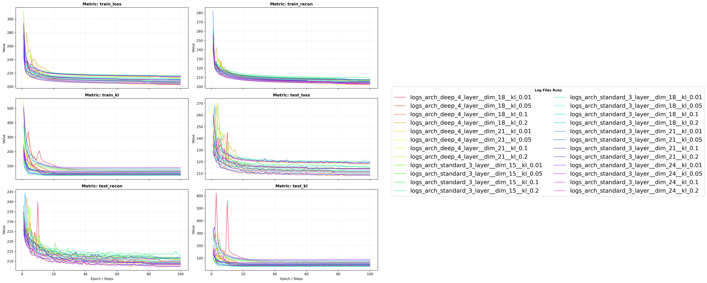
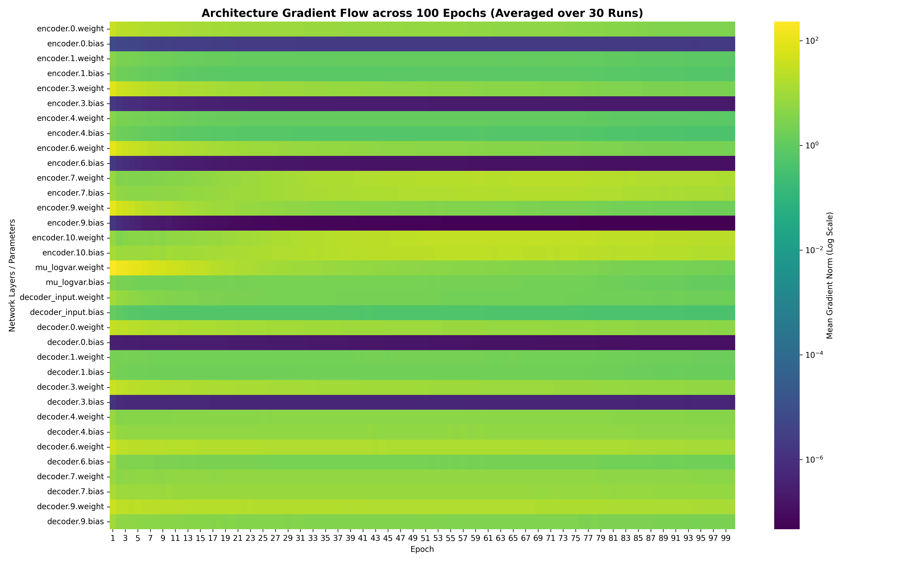
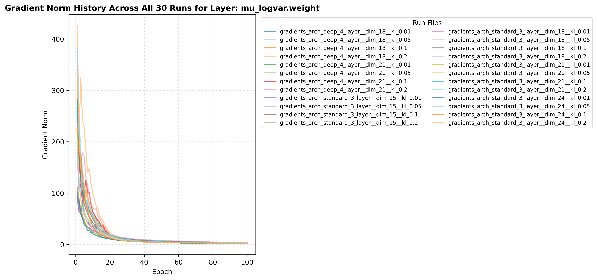
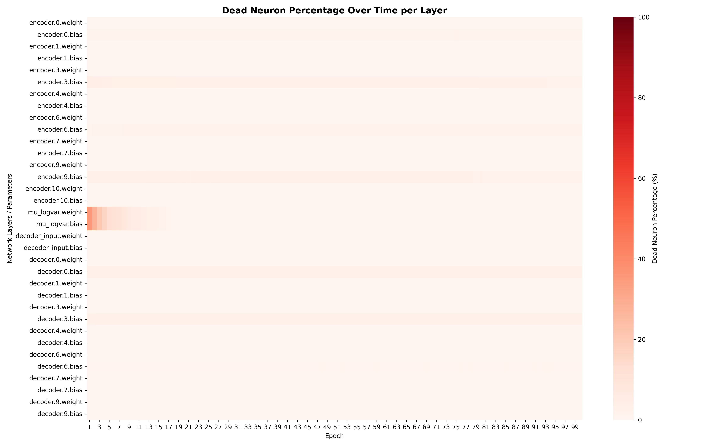

### Experimenting with VAEs using Fashion-MNIST Dataset.

<table>
  <tr>
    <td align="center">
      
      <br/>
      <b>Experiment Results</b>
    </td>
    <td align="center">
      
      <br/>
      <b>Gradient Flow Map</b>
    </td>
  </tr>
  <tr>
    <td align="center">
      
      <br/>
      <b>Trajectory for a Single Layer</b>
    </td>
    <td align="center">
      
      <br/>
      <b>Dead Neuron Percentage</b>
    </td>
  </tr>
</table>

### Above results are from the experiments across 24 different training runs. The config for these runs is under ```src/experiments```

## TODO:
### Different Variants of VAEs. More focus on CVAE.
